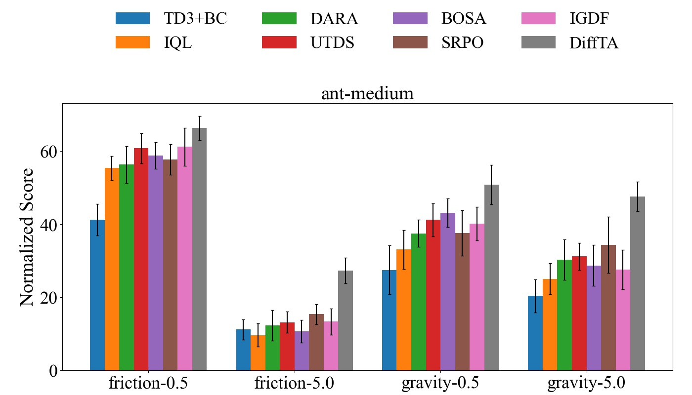
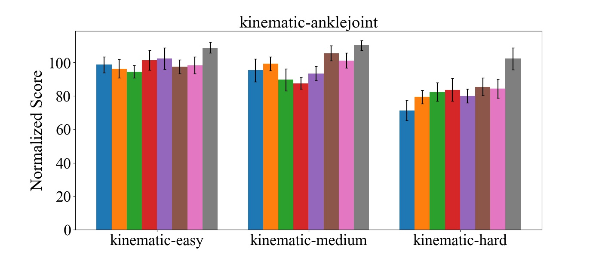
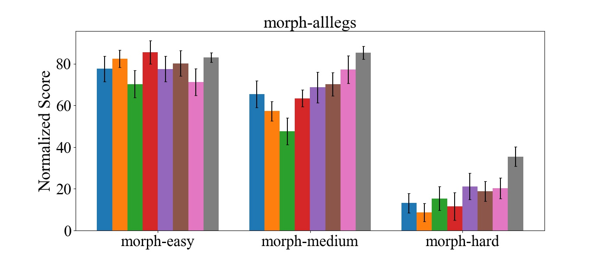
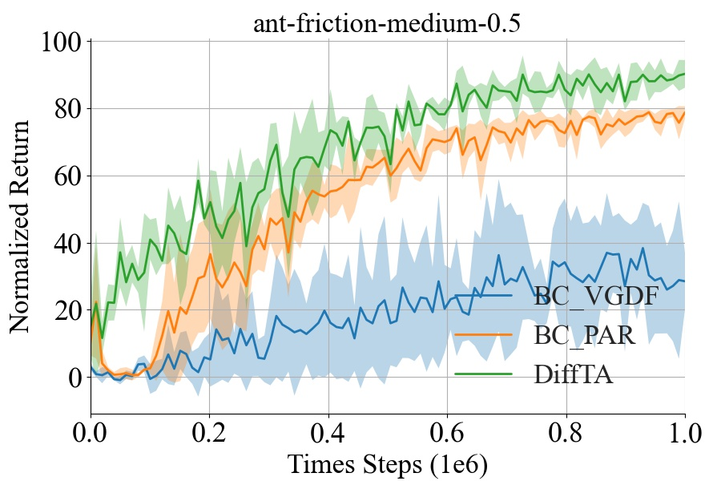
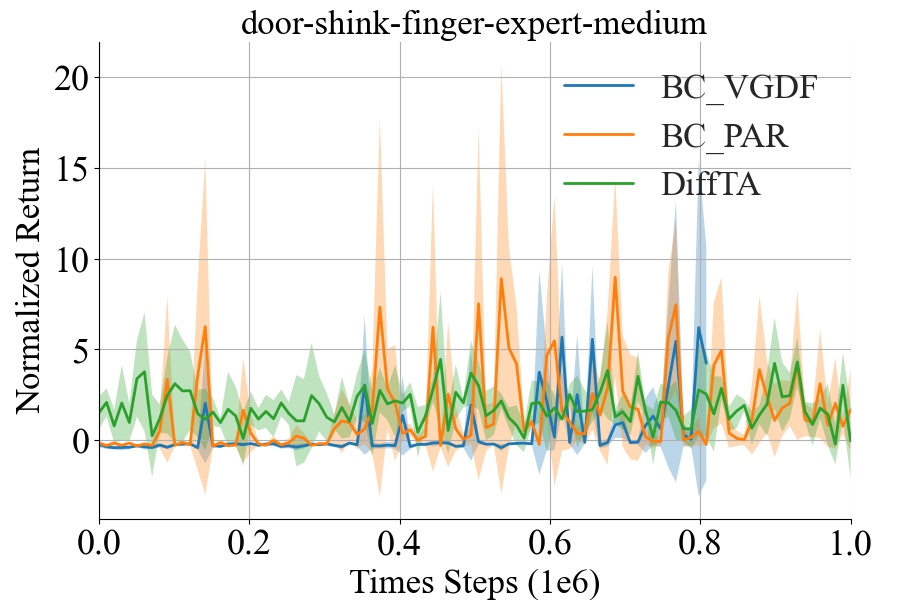
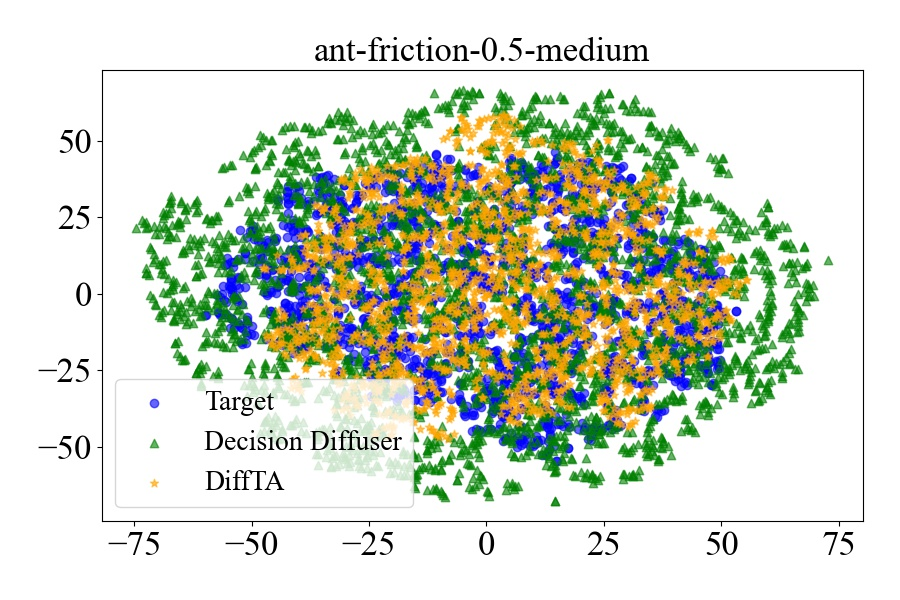
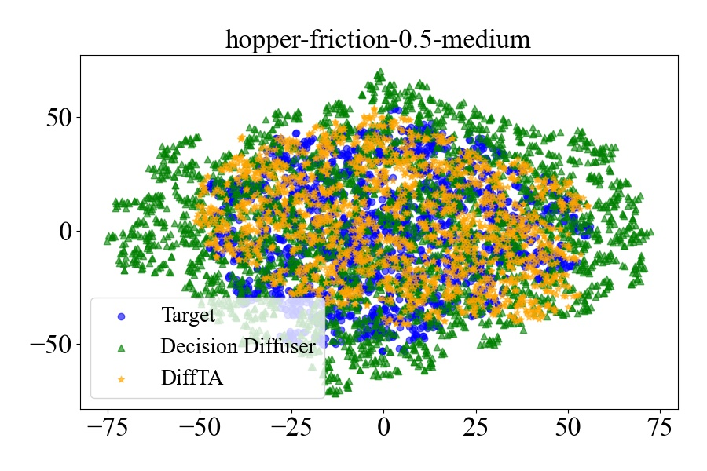
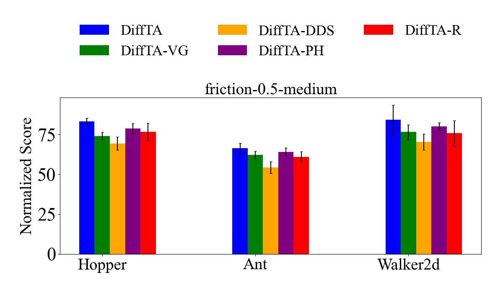
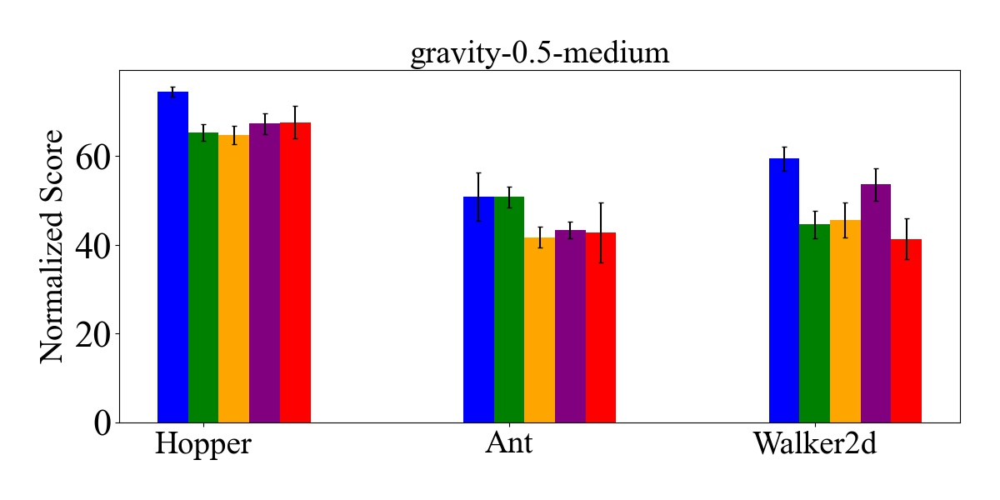

<h1 align = "center">Trajectory Alignment via Diffusion Models in Cross-Domain
Reinforcement Learning</h1>

## 🧠 Motivation and Key Contribution: A Generative Paradigm for Cross-Domain RL

Existing cross-domain offline RL methods typically focus on reweighting, relabeling, or filtering source-domain data to mitigate distribution shift. However, these approaches fundamentally rely on the quality and coverage of pre-existing data and struggle when the target domain exhibits sparse or divergent dynamics.

### DiffTA: From Data Reuse to Data Generation

**DiffTA introduces a new paradigm** — rather than selecting from suboptimal trajectories, it synthesizes new transitions that are inherently aligned with the target domain. This is made possible by the powerful generative capabilities of conditional diffusion models, enabling **offline generation of target-reliable data**.

### Key Innovations and Differentiators

- **Trajectory Generation over Selection**  
  Unlike prior methods such as **VGDF** or **IGDF** that manipulate existing samples, **DiffTA proactively generates** trajectories with three desired properties:  
  - **High return** (via *Value Guidance*)  
  - **Domain alignment** (via *Domain Discrepancy Score*)  
  - **Action feasibility** (via *Policy Harmonization*)

- **Triple-Conditioned Diffusion Architecture**  
  DiffTA constructs a semantic context vector for each trajectory, incorporating **VG, DDS, PH** signals to guide the diffusion process. This design enables controllable and structured generation of **goal-consistent trajectories**.

- **From Unreliable Signals to Reliable Data**  
  While prior approaches operate on noisy or insufficient data, DiffTA **transforms multiple weak priors into a coherent generative model**, offering a principled way to create new data tailored to target-domain requirements.
  
### On the Use of Pre-Trained Modules

Though DiffTA involves several pre-trained models — such as:
- *M* Gaussian dynamics models  
- 2 Q-value functions  
- 1 target-domain behavior policy  
- 1 inverse dynamics model  

> These modules are **not used independently to solve the task**, but instead **serve as auxiliary guidance signals** during generation.

Their role is to **encode prior knowledge** into the trajectory conditioning vector. This allows DiffTA to **fuse disparate learning signals into a unified data synthesis framework**, rather than simply aggregating multiple models.

### Summary

> **DiffTA is not an ensemble of partial solutions.**  
> It is a **generative mechanism** that transforms pre-trained knowledge into **target-consistent trajectories**, advancing the frontier from data reuse to **data creation** in cross-domain RL.

---------

## 📊 Experimental Addendum: Enhanced Reporting, Baselines, and Ablation Studies

Several reviewers raised valid concerns regarding experimental completeness and clarity, including:

- Lack of training efficiency and cost analysis for DiffTA.
- Missing standard deviations for baseline methods in main tables;
- Absence of error bars in performance plots;
- Lack of comparisons with recent strong baselines (e.g., PAR, Decision Diffuser);
- Limited ablation studies on key components.

In response, we provide expanded experimental results covering standard deviations, error bar visualizations, extended baseline 
comparisons (including PAR and Decision Diffuser), enriched ablations, 
and training cost analysis with **Efficient Diffusion Policy (EDP)** [Kang et al., 2023, NeurIPS]
 integration.

---

### 📌 1. Training Efficiency and Cost Analysis

In addition to performance metrics, several reviewers raised concerns about the **training cost** of DiffTA.

We address this by comparing our method’s efficiency to baselines and exploring a more efficient variant:

- The **original DiffTA** introduces extra cost due to auxiliary model pretraining and conditional diffusion training. Empirically, its overall training time is about **5.1×** that of IGDF.

- To improve efficiency, we adopt the **EDP**, replacing the original sampling process. EDP reduces the **trajectory generation cost by ~21×**, bringing total training time down to **2.4×** while maintaining competitive performance.

Below is a summary:

  Table 1. Training cost and performance comparison with EDP acceleration

| Method           | Training Time (Normalized) | halfCheetah-medium (friction-0.5) | walker2d-medium (friction-0.5) |
|------------------|----------------------------|-----------------------------------|--------------------------------|
| IGDF             | 1.0×                       | 48.7 ± 3.8                        | 76.3 ± 3.5                     |
| DiffTA (original)| 5.1×                       | 58.4 ± 2.2                        | 84.3 ± 9.1                     |
| DiffTA + EDP     | 2.4×                       | 54.5 ± 3.1                        | 79.6 ± 5.4                     |

All generation is conducted **offline**, and policy learning cost remains comparable to prior methods.
**Additional experiments and analysis will be included in the appendix of the final version.**

---

###  📌 2. Full Version of Main Tables (with Standard Deviations) and Error Bar Plots for Key Tasks

We now report **mean ± standard deviation across 5 seeds** for all baseline methods in Table 1 of main text. 

  Table 2. Performance comparison across different baselines under friction-0.5 and gravity-0.5 shifts. The best results are highlighted

| Shift Type  | Environment           | TD3+BC         | IQL            | DARA           | UTDS           | BOSA           | SRPO           | IGDF           | DiffTA              |
|-------------|------------------------|----------------|----------------|----------------|----------------|----------------|----------------|----------------|----------------------|
| friction-0.5 | halfcheetah-medium     | 34.7 ± 5.1     | 40.1 ± 4.6     | 43.3 ± 5.0     | 45.1 ± 4.8     | 51.3 ± 3.9     | 47.1 ± 4.4     | 48.7 ± 3.8     | **58.4 ± 2.2**       |
| friction-0.5 | halfcheetah-expert     | 70.6 ± 3.7     | 63.3 ± 5.3     | 75.4 ± 4.1     | 74.3 ± 4.4     | 80.4 ± 3.5     | 92.4 ± 3.9     | 87.6 ± 3.6     | **100.8 ± 3.5**      |
| friction-0.5 | hopper-medium          | 44.6 ± 3.2     | 60.4 ± 4.7     | 73.3 ± 4.2     | 76.2 ± 4.3     | 73.3 ± 3.8     | 77.6 ± 4.0     | 64.5 ± 4.5     | **83.3 ± 1.9**       |
| friction-0.5 | hopper-expert          | 76.4 ± 3.8     | 90.2 ± 3.6     | 87.7 ± 3.4     | 85.4 ± 3.9     | 94.6 ± 2.9     | 86.7 ± 3.6     | 92.3 ± 3.5     | **96.5 ± 2.8**       |
| friction-0.5 | walker2d-medium        | 57.3 ± 4.4     | 75.4 ± 3.1     | 63.1 ± 3.9     | 65.4 ± 4.0     | 63.7 ± **2.1**     | 66.4 ± 4.2     | 76.3 ± 3.5     | **84.3** ± 9.1       |
| friction-0.5 | walker2d-expert        | 87.7 ± 3.5     | 90.3 ± 3.3     | 90.4 ± 3.2     | 95.6 ± 4.1     | 93.1 ± 2.9     | 95.3 ± 5.1     | 86.4 ± 3.7     | **98.8 ± 2.4**       |
| friction-0.5 | ant-medium             | 41.2 ± 4.0     | 55.4 ± 3.8     | 56.3 ± 4.2     | 60.8 ± 5.1     | 58.8 ± 3.9     | 57.7 ± 4.7     | 61.2 ± 5.6     | **66.3 ± 3.3**       |
| friction-0.5 | ant-expert             | 34.2 ± 4.3     | 72.5 ± 3.7     | 77.3 ± 3.5     | 80.1 ± 4.3     | 71.8 ± 3.4     | 74.4 ± 3.9     | 77.6 ± **3.2**     | **81.2** ± 5.9 |
| gravity-0.5 | halfcheetah-medium     | 55.4 ± 4.8     | 58.3 ± 4.1     | 56.6 ± 4.2     | 59.3 ± 3.9     | 60.1 ± 4.3     | 67.3 ± 4.4     | 70.3 ± **3.6**     | **71.8** ± 7.3       |
| gravity-0.5 | halfcheetah-expert     | 57.4 ± 7.7     | 60.2 ± 3.6     | 57.7 ± 3.8     | 58.4 ± 4.5     | 65.5 ± 3.7     | 74.4 ± 2.8     | 77.4 ± 4.3     | **85.4 ± 2.1**       |
| gravity-0.5 | hopper-medium          | 40.3 ± 5.6     | 45.4 ± 3.7     | 30.3 ± 4.3     | 55.6 ± 2.9     | 49.3 ± 2.0     | 54.3 ± 4.1     | 60.3 ± 3.0     | **74.5 ± 1.2**       |
| gravity-0.5 | hopper-expert          | 55.6 ± 4.7     | 61.5 ± 3.6     | 63.4 ± 5.4     | 67.8 ± 6.3     | 73.1 ± 4.2     | 70.4 ± 5.6     | 76.3 ± 3.9     | **86.7 ± 3.5**       |
| gravity-0.5 | walker2d-medium        | 53.4 ± 4.2     | 56.7 ± 5.3     | 55.4 ± 4.1     | 56.3 ± 3.0     | **60.3** ± 3.8 | 58.7 ± 4.1     | 56.7 ± 3.9     | 59.4 ± **2.8**           |
| gravity-0.5 | walker2d-expert        | 64.3 ± 5.3     | 60.4 ± 3.7     | 65.3 ± 4.5     | 69.4 ± 3.6     | 68.3 ± 3.4     | 72.4 ± 4.2     | 74.1 ± **3.0**     | **79.6** ± 9.7       |
| gravity-0.5 | ant-medium             | 27.5 ± 6.5     | 33.1 ± 8.6     | 37.5 ± 5.3     | 41.2 ± 4.4     | 43.1 ± **4.1**     | 37.6 ± 5.0     | 40.2 ± 4.9     | **50.8** ± 5.4       |
| gravity-0.5 | ant-expert             | 24.3 ± 7.9     | 34.2 ± 6.3     | 28.4 ± 7.1     | 44.3 ± 5.7     | 44.5 ± 5.6     | 43.5 ± 4.9     | 42.4 ± 4.4     | **56.7 ± 4.1**       |
| gravity-0.5 | **Average**            | 51.6     | 59.8     | 59.2      | 60.1     | 65.7     | 67.3     | 68.3     | **77.2**       |

> Note that the error bar plots and the mean ± standard deviation values in the table 
> convey similar information. For instance, in Table 2 of main text, we use error bar plots for a more 
> intuitive visualization of the results. 
> **A more comprehensive set of error bar charts will be included in the appendix of the final version.**

---

###  📌 3. Error Bar Plots for Key Tasks

Below, we present the error bar plots for some of the results in Table 2. 
Each figure clearly shows mean and standard deviation for all methods, highlighting performance robustness and significance.

        
    
    

Figure 1. Average returns (bars) and standard deviations (error bars) of differnet methods under diverse domain shift tasks 

### 📌 4. Extended Baseline Comparisons: PAR, Decision Diffuser, OTDF

We extend our baseline comparisons to include recent strong methods, including:

- **PAR** [Lyu et al., 2024, ICLR]
- **Vanilla Decision Diffuser (DD)** [Ajay et al., 2023]

We conduct preliminary comparisons on both locomotion and Adroit domains using environments from ODRL. The evaluations are conducted under the **Offline-Online** setting: source data is offline (D4RL), while target environments are accessible for interaction. Following ODRL and the original papers, PAR augments data via optimal transport and imitation, and DD uses augmented target transitions for return-conditioned generation.

####  Performance Comparison (Offline-Online Setting)

     
     

Figure 2. Comparative mean performance analysis of BC_VGDF, BC_PAR and DiffTA

     
     

Figure 3. t-SNE visualization of generated trajectories and target
domain trajectories

These results indicate that:
- On **Adroit**, most methods struggle due to challenging morphology and high-dimensional control—**this aligns with observations from the ODRL benchmark**.
- While PAR outperforms VGDF in some locomotion settings, our **DiffTA achieves the strongest overall results**, confirming its effectiveness in aligning dynamics and generating reliable high-return data across domains.
- **Decision Diffuser**, like other generative methods, **struggles to generate data that matches the target domain's dynamics**, leading to significant mismatch and performance degradation. This further emphasizes the advantage of DiffTA in generating domain-aligned trajectories.

We will include full PAR and DD results across all tasks in the final version, and additionally incorporate the latest **OTDF** [ICLR 2025] for comparison and discussion.

---

### 📌 5. Enriched Ablation Studies

We conduct an ablation study on the **Reward Context**, a key component in DiffTA’s trajectory conditioning mechanism.

       
    

Figure 2. Average returns (bars) and standard deviations (error
bars) for DiffTA and its ablated variants (removing one component
at a time) 

The ablation study showed a **5.4–18.1 point** performance drop when the **Reward Context** was removed, raising the question of whether the **Reward Context** is more important than the other components in DiffTA. Here's the analysis:

#### （1） **Role of Reward Context**:
   - The Reward Context ensures that the model generates trajectories that align with the task's objectives by prioritizing high-reward actions. Without it, the model can still generate valid trajectories, but they may not be optimal in terms of task alignment and reward maximization.

#### （2） **Complementary Roles of Reward Context and Value Guidance**:
   - Value Guidance helps prioritize transitions with high value, and when combined with Reward Context, it ensures that the generated trajectories maximize rewards. Reward Context alone cannot replace the value-driven focus of VG, explaining part of the performance drop when Reward Context is removed.

#### (3)  **Interaction with Domain Discrepancy Score**:
   - Domain Discrepancy Score aligns the source and target domain dynamics, ensuring that generated trajectories are realistic. However, without Reward Context, the model may fail to focus on reward-maximizing actions, even if the trajectories are dynamically aligned with the target domain.

#### (4) **Interaction with Policy Harmonization**:
   - Policy Harmonization ensures that the generated actions are feasible, but it does not directly impact the reward structure. Reward Context is necessary to ensure that the actions generated are also rewarding, which is crucial for improving task performance.

### Conclusion: Reward Context vs Other Components
While Reward Context plays a crucial role in aligning the generated trajectories with the task’s objectives, it is most effective when combined with Value Guidance, Domain Discrepancy Score, and olicy Harmonization. The **5.4–18.1 point** drop in performance highlights its importance, but also underscores that no single component is sufficient on its own. 
As shown in the first row of Figure 1 in the main text, when only Reward Context is kept without the other contexts, the performance is significantly worse. This further demonstrates that **the full set of components is essential for the effectiveness of DiffTA.**

> We hope these improvements address the reviewers’ concerns and further demonstrate the robustness, effectiveness, and novelty of DiffTA across cross-domain offline RL settings. **These updates will be included in the final version and appendix to ensure experimental soundness, transparency, and stronger conclusions.**

---

## 🔍 Response to Theoretical Concerns

We sincerely thank the reviewers for their detailed and constructive feedback regarding our theoretical analysis. Below, we provide a comprehensive point-by-point clarification and correction, addressing the major concerns related to Theorems 1 and 2.

### 📌 1. Clarification on Theorem 1: Assumptions and Context Role

**Concern**: Theorem 1 is a basic result from convex optimization, and the assumptions—especially strong convexity and the boundedness of context—may not hold in diffusion models.

We fully agree that the assumptions may not globally hold in deep conditional diffusion models. However, we emphasize that:

- **Purpose**: Theorem 1 is not intended as a novel theoretical contribution. Instead, it serves as a **sanity check** to show that introducing multi-dimensional semantic context (VG, DDS, PH) **does not break the training stability** of diffusion models under standard assumptions.

- **Bounded Context Usage**: While we omitted this in the original proof, the boundedness assumption $\|c(\tau)\|_2 \leq C$ ensures that the loss $\mathcal{L}(\theta)$ remains **Lipschitz-smooth**, which is crucial for convergence guarantees. We will revise the proof to make this connection explicit.

- **On Local Strong Convexity**: The original statement about "local strong convexity of the diffusion loss" was imprecise. We will revise this to:
  > “The $\ell_2$ diffusion loss can be *approximately considered locally strongly convex* near optimal solutions,”  
  which is a common approximation in DDPM and related literature. We will also cite relevant prior works and clarify this is only a local approximation.

- **Clarification on Contribution**: We acknowledge that Theorem 1 does not provide a new optimization insight but acts as **a theoretical justification for design soundness** under standard smoothness and stability conditions.

---

### 📌 2. Clarification on Theorem 2: Definitions and Algorithm Connection

**Concern**: Several terms (e.g., $R_{\text{tar}}, R_{\text{src}}, \hat{R}_{\text{tar}}, \mathcal{H}$) are undefined, and the relationship between DDS and the algorithm is unclear.

We agree that the original statement was incomplete. We now clarify:

- **Definitions**:
  - $\mathcal{H}$: Hypothesis class of return estimators, i.e., functions predicting $R(\tau)$.
  - $R_{\text{tar}}, R_{\text{src}}$: Expected returns of the **same policy $\pi$**, trained using DiffTA-generated data, but evaluated under the **target** and **source** domain dynamics.
  - $\hat{R}_{\text{tar}}$: Empirical estimate of $R_{\text{tar}}$ from sampled target domain data.

- **Sampling Assumption**: We assume transitions are sampled i.i.d. from the source and target offline datasets ($\mathcal{D}_{\text{src}}, \mathcal{D}_{\text{tar}}$), which is standard in offline RL generalization theory.

- **Fixing Typos**: The definition of DDS was mistakenly referred to as Eq. (10); it should be **Eq. (13)**. We appreciate the reviewer’s attention to this detail and will fix this in the final version.

- **Connecting DDS to Algorithm**:
  - **In practice**, DDS is used to construct the trajectory-level condition vector $c(\tau)$, which guides trajectory generation.
  - **In theory**, the expected domain discrepancy $\mathbb{E}_{\mathcal{D}_{\text{src}}}[1 - \Delta_{\text{DDS}}]$ appears in the generalization bound:
    $$
    R_{\text{tar}} - R_{\text{src}} \leq 2B \sqrt{\frac{\log(2/\delta)}{n}} + \lambda \mathbb{E}_{\mathcal{D}_{\text{src}}}[1 - \Delta_{\text{DDS}}],
    $$
    which quantifies how well the generated trajectories align with the target domain’s dynamics.

- **Core Insight**: This theoretical result illustrates that **DDS is not only a heuristic** but also **theoretically correlated with cross-domain generalization**. As DDS approaches 1 (perfect dynamic alignment), the domain gap shrinks.

### Summary and Revision Plan

To improve clarity and rigor in the final version, we will:

- Precisely define all variables and assumptions in both theorems;
- Clarify that the theoretical results are *not central contributions*, but supportive insights;
- Correct typographical errors and improve the connection between theory and algorithm;
- Add contextual discussion in the appendix about local smoothness/convexity and real-world approximations.

We once again thank the reviewers for pushing us to refine the theoretical presentation and better position it within the scope of the paper.

---
